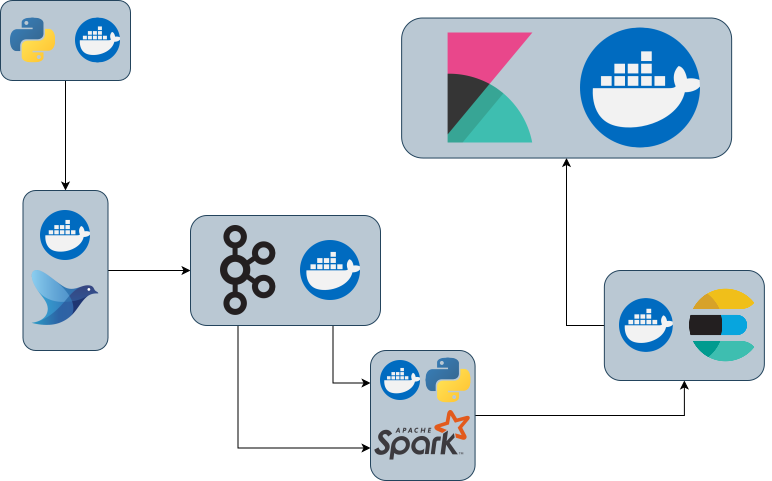

# WebMeteo
Tired of looking at web pages for the weather and hoping it matches? .. yes, me too. WebMeteo
is an application that, with the use of recent technologies, allows you to collect meteorological data
including, in particular, the weather conditions; thanks to the latter it is possible to classify appropriately
the status of a particular event and show precise data predictions!

## Features
* Collection of meteorological data with python and Selenium
* Using Fluentd for the injection of weather data
* Using Apache Kafka to stream weather events
* Elaboration of the weather conditions with Apache Spark
* Use of Elasticsearch to store and easily retrieve the collected data
* Using Kibana to view the data recorded in Elasticsearch

## Pipeline

  

## How to Run
'''shell
git clone https://github.com/erotablas/WebMeteo.git
cd WebMeteo
docker-compose up --build
'''

## Links
| Container     | URL                                        | Description                                     |
| ------------- | ------------------------------------------ | ----------------------------------------------- |
| kafka UI      | http://localhost:8080                      | Open kafka UI to monitor Kafka Broker           |
| Elasticsearch | http://localhost:9200                      | Open Elasticsearch to manage indexes            |
| kibana        | http://localhost:5601                      | Open Kibana to view data and create a dashboard |

## Bibliography
[sparkdl](https://github.com/innat/Transfer-Learning-PySpark)
...
